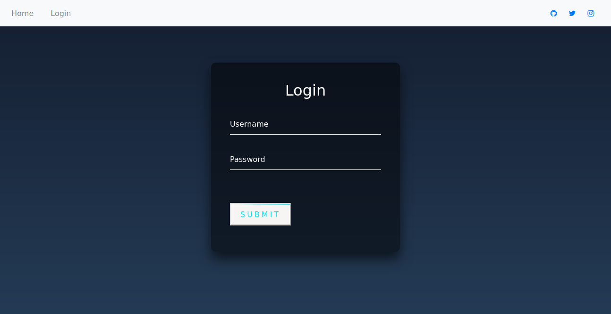
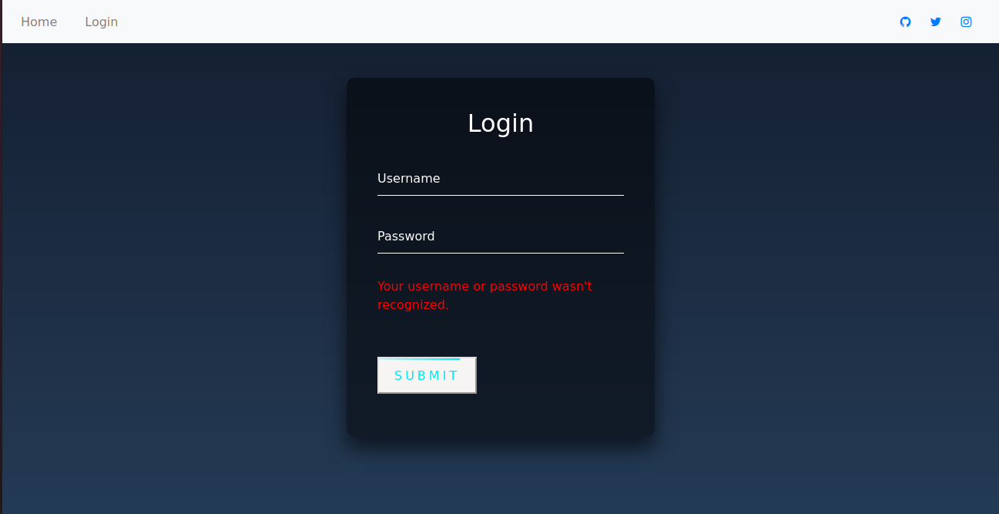

1. Clone the repository:
<pre>git clone https://github.com/mikailaydogdu/simple-django-login.git</pre>

2. Run migrations:
<pre>python manage.py migrate</pre>

3. Create a user:
<pre>python manage.py createsuperuser</pre>

4. Run the server:
<pre>python manage.py runserver</pre>

5. And open 127.0.0.1:8000/login in your web browser.
